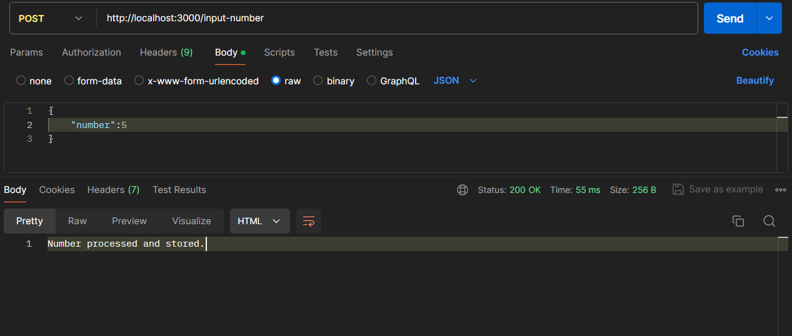
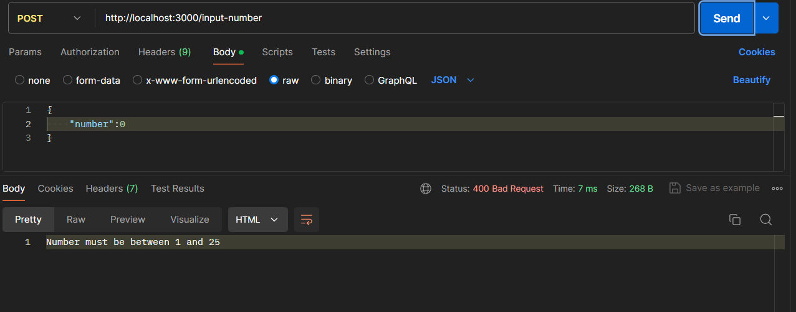
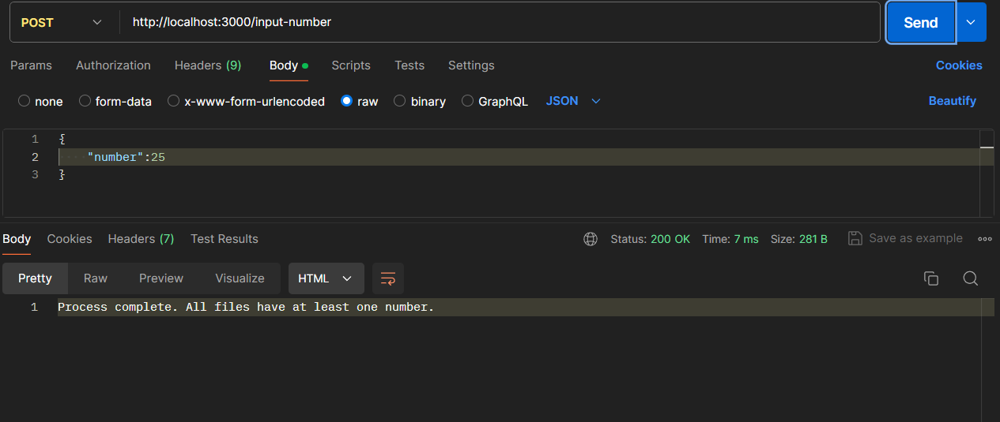
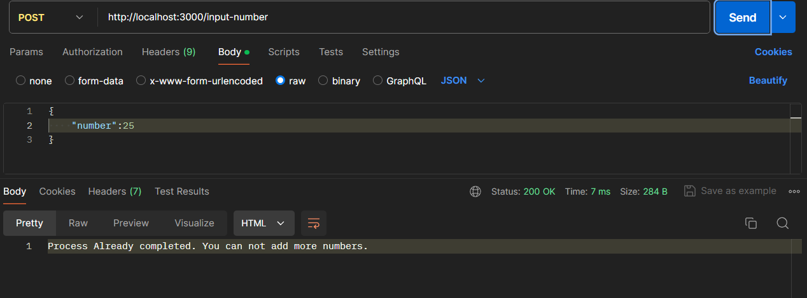
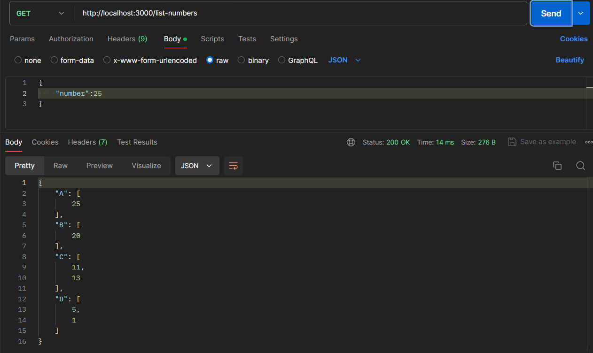

# Scenarios to Test:

Valid Input (1-25):

Input: 5
Expected: Number processed and stored.

Invalid Input (<1 or >25):
Input: 0 or 26
Expected: Error message "Number must be between 1 and 25"

All Files Populated:
Input numbers to ensure all files (A, B, C, D) have at least one number.
Expected: Message "Process complete. All files have at least one number."
Listing Numbers:

Use GET request to /list-numbers
Expected: List of numbers in all files.

